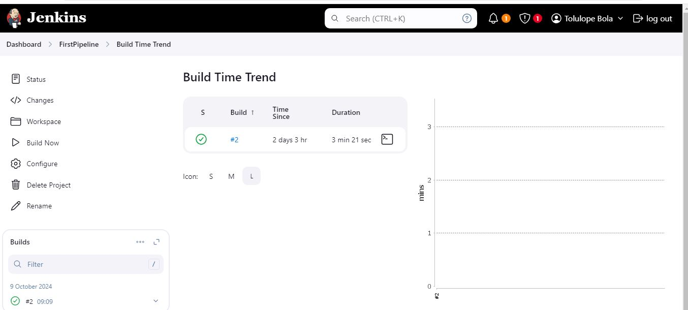
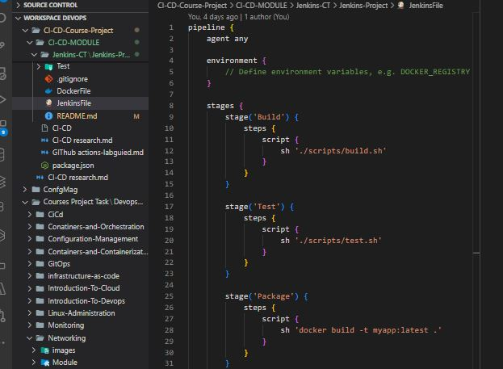
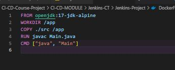
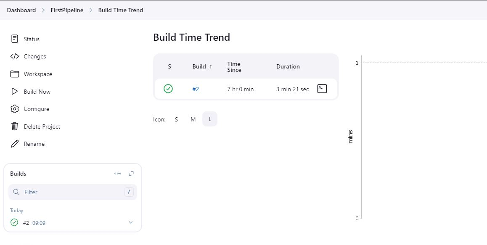

# **JENKINS PROJECT**

## Project Implementation:

### Step 1: Install Jenkins on Local Machine

### Step 2: Setting up dependicies such as dockerfile, jenkins file.

### Step 3: Running the Build stage of the Pipline

The jenkins pipeline has successfully completed the second build (#2) in 3 minutes and 21 seconds, and the status shows a green check mark, meaning the build was successful.
